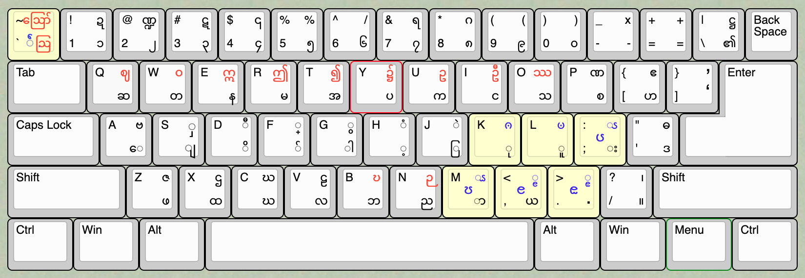

# Myancode - Myanmar Unicode Keyboard

**( သက္ကတစာလုံးအပြည့်အစုံပါဝင်ပါသည်။ )**

ခဲတံ ဘောပင်တိုဖြင့် စာရေးခဲ့သကဲ့သို့ စာရိုက်နိုင်သော လက်ကွက်ဖြစ်ပါသည်။ 

## လက်ကွက်နေရာများ

shift မနှိပ်ဘဲ ဒီတိုင်း ရိုးရိုးရိုက်ရသော key များအားလုံး ဝင်းအင်းဝနှင့် အကုန်တူပါသည်။ shift နှင့်တွဲရိုက်⁠ရသော key များတွင် မလိုရာတချို့ဖြုတ်၍ လိုရာတချို့ ဖြ​ည့်စွက်ထားပါသည်။

( ဝင်းအင်းဝနှင့် မတူသော အက္ခရာနေရာများကို အနီရောင်ဖြင့် ပြထားပါသည်။ သက္ကတစာလုံးများနေရာကို အပြာရောင်ဖြင့် ပြထားပါသည်။ )

## သဝေထိုး

သဝေထိုးအရင်ရိုက်သော စနစ်ဖြစ်ပါသည်။ 

|  စာသား | မြန်မာအက္ခရာများ  | keys
|---|---|---|
|မေမေ| ⁠ေ + မ + ⁠ေ + မ  |a + r + a + r |
|သောကြာ| ⁠ေ + သ + ာ + က +  ြ  +  ာ |a + o + m + u + j + m |
| | |

## ဗျည်းတွဲ ဗျည်းယှဥ်သရများ

ယပင့် ရရစ် ဝဆွဲ ဟထိုး လုံးကြီးတင်၊ တချောင်းငင်၊ သေးသေးတင်၊ အောက်မြစ် စသည်တို့ကို သင်ပုန်ကြီး အစဉ်ကျအောင်  ရိုက်ရပါမည်။ ⁠

ဗျည်းပြီးမှ ရရစ်စသည်ကို ရိုက်ရမည်။ အစဉ်မှားက အလိုအ⁠လျောက် ပြင်ဆင်ပေးမည် မဟုတ်ဘဲ အစဉ်မှားသော အက္ခရာများကို ဖျက်ပစ်ပါသည်။ မိမိရိုက်⁠လိုက်သော အက္ခရာတွဲများ မပေါ် ပျက်သွားပါက အစဉ်မှားနေပြီဟု သိပါ။ 

|စာသား | အက္ခရာများ| keys |
| --- | --- | --- |
| မျှစ် | မ + ျ + ှ + စ + ်| r + s + S + p + f|
| မွှေး | ⁠ေ + မ + ွ + ှ| a + r + G + S + ;|
|ကျွေး | ⁠ေ + က + ျ + ွ + း | a + u + s + G + ;|
| မှို| မ + ှ + ိ + ု | r + S + d + k |
| ကျို| က + ျ + ိ + ု | u + s + d+ k |
| မြို့| မ + ြ + ိ + ု + ့| r + j + d + k + h|
| မြှင့်| မ + ြ + ှ + င +် + ့ | r + j + S + i + f + h |
| မြှုံး| မ + ြ + ှ + ု + ံ + း | r + j + S + k + H + ;|
| ကံ့ | က + ံ + ့ | u + H + h|
| ဘွဲံ | ဘ + ွ + ဲ + ့| b + G + J + h|
| ခေါ်| ⁠ေ + ခ + ါ + ်| a + c + g + f |

## ပါဌ်ဆင့် ( နှစ်လုံးဆင့် )

က္က နှစ်လုံးဆင့်ကို ရိုက်လိုပါက အပေါ်က (က) ကို ပုံမှန်ရိုက်နေကျအတိုင်း ရိုက်ပါ။ အောက်၌ ရှိသော(က) ကို ရိုက်လိုပါက  shift + f ကို အရင်ရိုက်ပြီး နောက်မှ အောက်၌ ထားလိုသော (က) ဗျည်းကို ရိုက်ပါ။ ( shift + f ရိုက်ချိန် ပေါ်လာသော သ​င်္ကေတ [  ္] ကို ဝိရာမဟု ခေါ်သတတ်။ )

|စာသား|မြန်မာအက္ခရာများ| keys|
|---|---|---|---|
| စက္ကူ | စ + က + ္ + ူ | p + u + F + u + k |
| ဥက္ကဋ္ဌ | ဥ + က + ္ + က + ဋ + ္ + ဌ | U + u + F + u + # + F + X |
| ဘန္တေ | ဘ + ⁠ေ + န + ္ + တ | b + a + e + F + w |
| ကဏ္ဍ | က + ဏ + ္ + ဍ | u + P + F + ! |
| ဝုဍ္ဎ | ဝ + ု + ဍ + ္ + ဎ | W + k + ! + F + B |
| ပဉ္စမ | ပ + ဉ + ္ + စ + မ | y + N + F + p + r |

## ကင်းစီး

ကင်းစီးကို အောက်ခံဗျည်း ရိုက်ပြီးမှ ( ရံခါ ဗျည်း + ဗျည်းတွဲ ) f key ကို နှစ်ကြိမ်ရိုက်၍ ရိုက်နိုင်ပါသည်။ 

**( အသတ်ခလုပ်နေရာကို နှစ်ကြိမ်ရိုက်ပါ။ ဖုန်းတို့တွင် ပါ⁠သော double tap သဘောမျိုး ဖြစ်ပါသည်။ )**

|စာသား | မြန်မာအက္ခရာများ| keys |
| ---|---|---|
| မ​င်္ဂလာ | မ + ဂ + ် + ် + လ + ာ | r + * + f + f + v + m |
| အ​င်္ကျီ | အ + က +  ျ + ် + ် + ီ | t + u + s + f + f + D |
| သ​င်္ဘော | သ + ⁠ေ + ဘ + ် + ် + ာ| o + a + b + f + f + m |
| သ​င်္ကြန် | သ + က + ြ + ် + ် + န + ် | o + u + j + f + f + e + f |
| ခြ​င်္သေ့ | ခ + ြ + ⁠ေ + သ + ် + ် | c + j + a + o + f + f |

**( ကင်းစီးကို ယူနီကုဒ်သိမ်းဆည်းမှုအစဉ်အားဖြင့် ရိုက်လိုကလည်း ရိုက်နိုင်ပါသည်။)**
### ယူနီကုဒ်သိမ်းဆည်းမှုအစဥ်အားဖြင့် ရိုက်ပုံ
|စာသား | မြန်မာအက္ခရာများ| keys |
| ---|---|---|
| မ​င်္ဂလာ | မ + င + ် +  ္ +  လ + ာ | r + i + f + F + * + v + m |
| အ​င်္ကျီ | အ + င + ် +  ္  + က +  ျ +  ီ | t + i + f + F + u + s + D |
| သ​င်္ဘော | သ + င + ် +  ္ + ⁠ေ + ဘ + ာ| o + i + f + F + a + b + m |

## သတိပြုရန် အက္ခရာများ
-   ရကောက် (ရ) နှင့် ခုနှစ် (၇)
-   ဂငယ် (ဂ) နှင့် ရှစ် (၈)
-   ဝလုံး (ဝ) နှင့် သုည (၀)
-   ဥ သရ နှင့် ဉ ကလေး
-   ဈ ဈမျဉ်းဆွဲ နှင့် စျ စလုံး + ယင့်
-   ဩ သရနှင့် ဩ သ+ရရစ် 
-   ဦ သရနှင့် ဦ ဥ + လုံးကြီးတင်ဆံခတ်

မတူသည်ကို သတိပြုပါ။

( စလုံး+ယပင့်အသုံး ပါဠိ၌ ထင်၏။  မွန်၊ကရင်စသည်တို့၌ သ+ရရစ် အသုံးရှိသတဲ့။ )

| စာသား | အက္ခရာများ | keys | မှတ်ချက် |
|---|---|---|---|
| စဉ်းစား | စ + ဉ + ် + စ + ာ + း| p + N + f + ; + p + m + ; | ဉ အစား ဥ ဖြင့် မရိုက်ရပါ။|
| ပဉှာ | ပ + ဉ + ှ + ာ| y + N + S + m | ။ ။ |
|ဝိုးတဝါး| ဝ + ိ + ု + း + တ + ဝ+ ါ + း | W + d + k + ; w + W + g + ;| သုညဖြင့်မရိုက်ရပါ။|
|ဈေး| ⁠ေ + ဈ | a + Q | စလုံးယပင့်ဖြင့် မရိုက်ရ|

## သက္ကတအက္ခရာများ

-   ၐ ၊ ၑ ဟူသော ဗျည်းနှစ်လုံး 
-   ၒ ၊ ၓ ၊ ၔ ၊ ၕ ဟူသော သရလေးလုံး
-    ၖ ၊  ၗ ၊  ၘ ၊  ၙ ဟူသော အထက်ပါသ⁠ရလေးလုံးတို့၏ ⁠ဗျည်းနှင့်တွဲစပ်ခိုက် ပုံသဏ္ဍာန် 

### keys mapping
| key | အက္ခရာ |
|---|---|
| K | ၐ |
| L | ၑ |
| : |  ၖ |
| < |  ၗ |
| > |  ၘ |
| ? |  ၙ |

key အားလုံး shift ဖြင့် တွဲရိုက်ရပါသည်။ ဗျည်းနှင့်မစပ်သော သရလေးလုံးထက် ထိုသရတို့၏ ဗျည်းနှင့်စပ်သော ပုံသဏ္ဍာန်ကို အတွေ့များသည်ဟု ထင်မိသောကြောင့် ထိုဗျည်းနှင့်တွဲစပ်ခိုက် ပုံသဏ္ဍာန်ကို ဦးစားပေးထား၍ သီးသန့် key ထည့်ထားပေးသည်။ ဗျည်းနှင့်မစပ်သာ သရလေးကို ရိုက်လိုပါက ဗျည်းစပ်သရပုံသဏ္ဍာန်ကို နှစ်ကြိမ်ရိုက်ပါ။ (double tap သဘောမျိုးဖြစ်ပါသည်။ key သီးသန့်မမှတ်လို မထည့်လိုသောကြောင့် double tap စနစ်မျိုးကို အသုံးပြုထားပါသည်။)

| စာသား | အက္ခရာများ | keys |
|---|---|---|
| ၒ |  ၖ +  ၖ |  : + : |
| ၔ | ၗ + ၗ | < + < |
| ၔ |  ၘ +  ၘ  | > + > |
| ၕ |  ၙ +  ၙ | ? + ? |

### ရေဖ - ရ်္

ရ + ် +  ္ သုံးပြီး ရိုက်ရမည်ဟု ဆိုထား၏။ key သုံး၍ ရိုက်လိုက right alt ( alt_gr ) နှင့် ` key ကို တွဲပြီး ရိုက်နိုင်ပါသည်။ (ဩ ကို ရိုက်သော key နေရာ)

## puntuations

အ​​င်္ဂလိပ်စာ၌ ပါသော puntuations တို့ကို သက်ဆိုင်ရာနေတို့၌ right alt (alt_gr) key ဖြင့် တွဲ၍ ရိုက်နိုင်ပါသည်။ ( right alt အစား ctrl + alt တွဲသုံးနိုင်ပါသည်။ အ​င်္ဂလိပ်ဂဏာန်းတို့ကိုလည်း shift + right alt တွဲသုံးပြီး ရိုက်နိုင်ပါသည်။